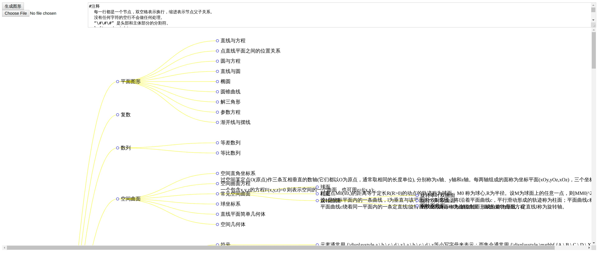
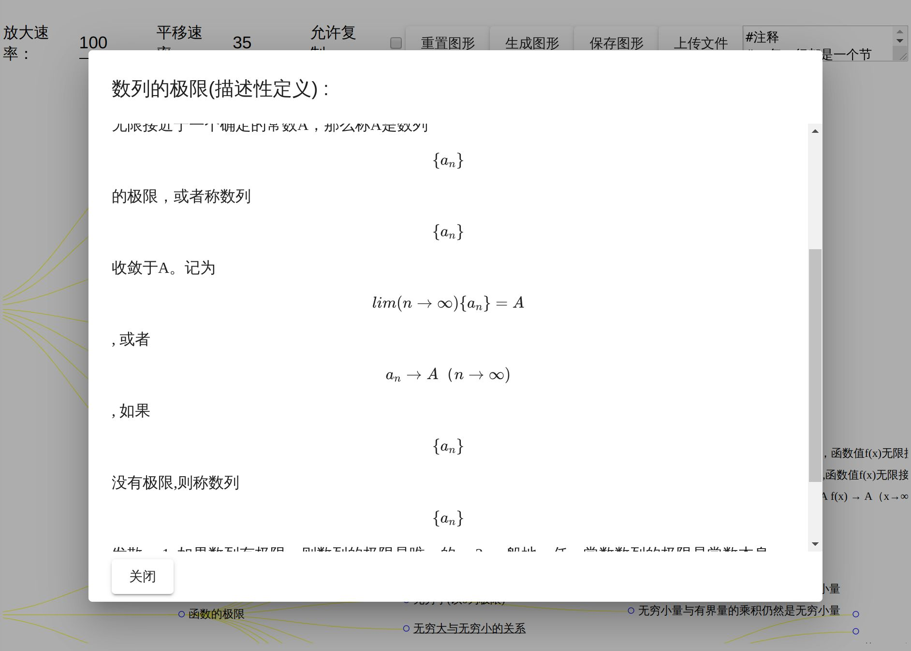

# Math-study

__数学各个方面的知识，包括和计算机相关的(没有习题)__ _这个思路可以用来学习其它方面的知识。_

 考虑了一下，不使用canvas绘图以方便搜索。
>math.gd 是主要内容  
>这个应用算是个显示的工具。

滚轮缩放

## 运行方法

1. npm install
2. npm run start
3. 浏览器打开[http://localhost:4200](http://localhost:4200)
4. 选择math.gd文件

## _未完成_

1. 图需要优化距离和换行。
2. 内容没有完成。
3. SVG中的公式需要处理。
