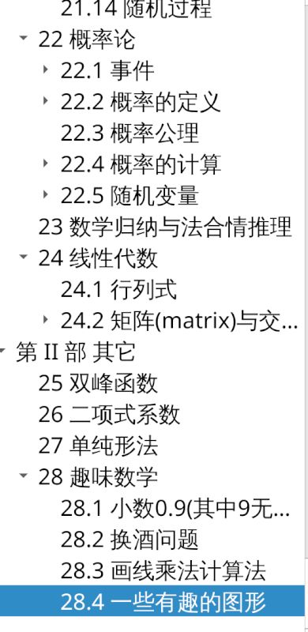

# Math-study

使用lyx编写, [lyx 下载地址](https://www.lyx.org/Download).

打开```Math.lyx``` 即可查阅.

``img`` 是展示图片;
```image``` 是`Math.lyx` 使用到的图片




[查看旧版内容](https://github.com/ZTFtrue/Math-study/releases/tag/v0.0.4-alpha)
