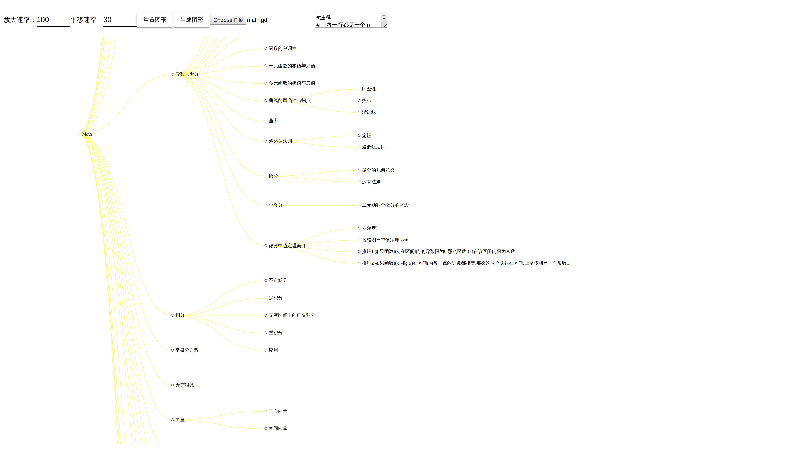

# Math-study

__数学各个方面的知识，包括和计算机相关的。[math.gd](https://github.com/ZTFtrue/Math-study/blob/master/math.gd) 是显示的内容  

## 运行已编译好的

 到[release](https://github.com/ZTFtrue/Math-study/releases)下载工具，选择math.gd文件即可。



## 通过源代码使用

1. npm install
2. npm run start
3. 选择math.gd文件

linux 用户可能会遇到如下问题

```sh
[12419:0602/204432.273114:FATAL:setuid_sandbox_host.cc(157)] The SUID sandbox helper binary was found, but is not configured correctly. Rather than run without sandboxing I'm aborting now. You need to make sure that ./node_modules/electron/dist/chrome-sandbox is owned by root and has mode 4755.
```

暂时我没有找到好的解决办法 [参考](https://github.com/electron/electron/issues/17972)。

```sh
sudo chown root your_path/node_modules/electron/dist/chrome-sandbox
sudo chmod 4755 your_path/node_modules/electron/dist/chrome-sandbox
```

或者

```sh
# 也可以直接配置sysctl
sudo sysctl kernel.unprivileged_userns_clone=1
```

## 问题

  1. 设置angualr 编译选项 optimization:false 才可以显示数学公式
